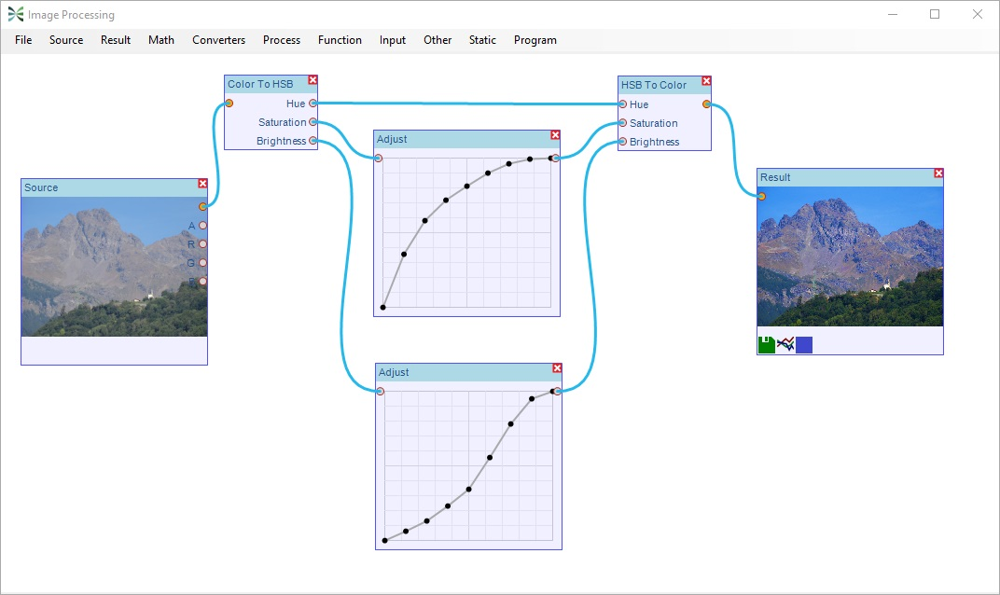
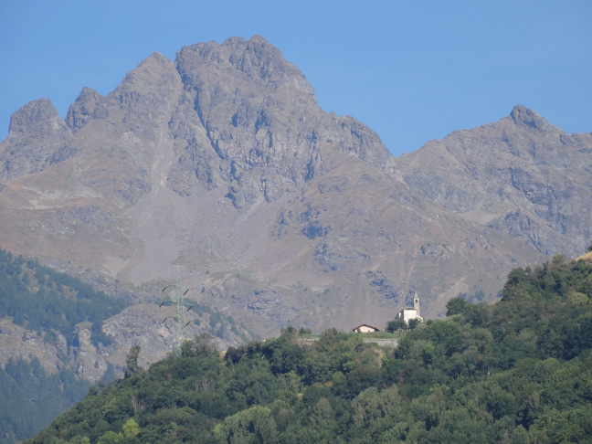
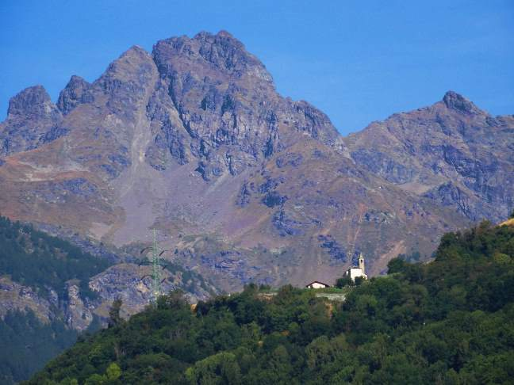
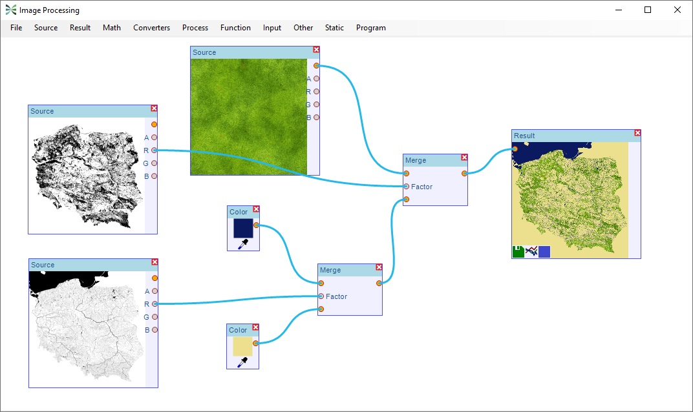
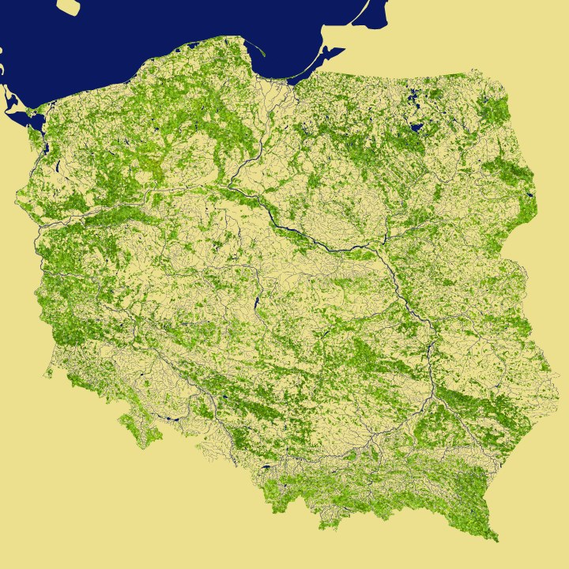
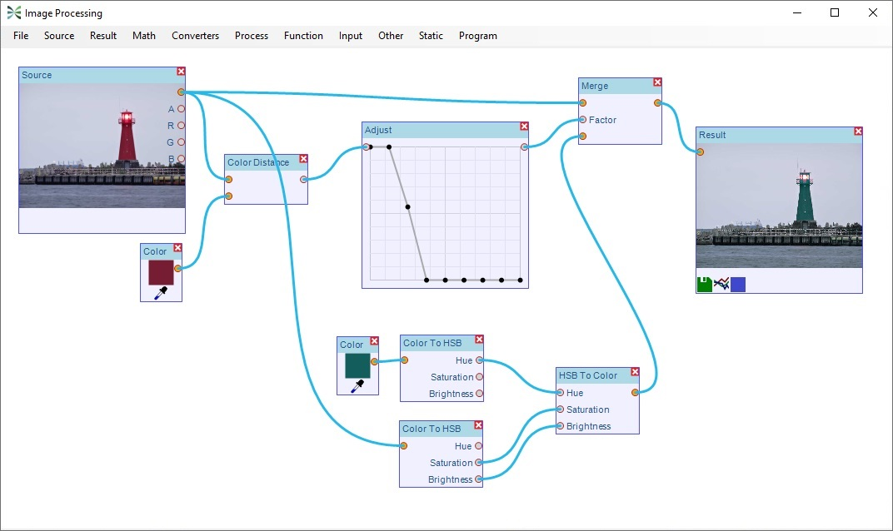
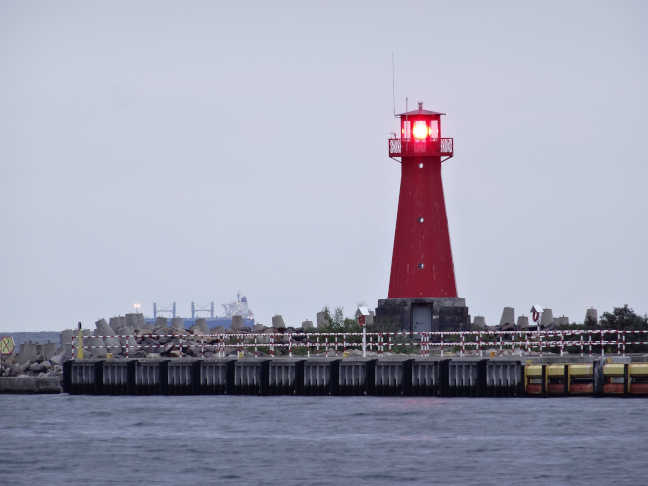
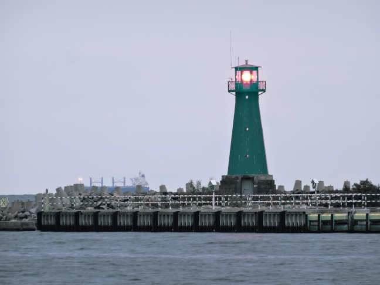

# Image Processing

Image Processing is a raster graphics program in node based workflow.

It is written in C# using .Net Framework and Windows Forms.

## Usage examples

### Improving photo quality

#### Original

#### Result

### Combining images

### Substituting color

#### Original

#### Result

## Coding interesting points
- To increase performance, optimization using SIMD instructions and multitasking is applied
- Python script can be written to fulfill unusual requests (it is implemented using [IronPython][1] library)

[1]: https://ironpython.net/